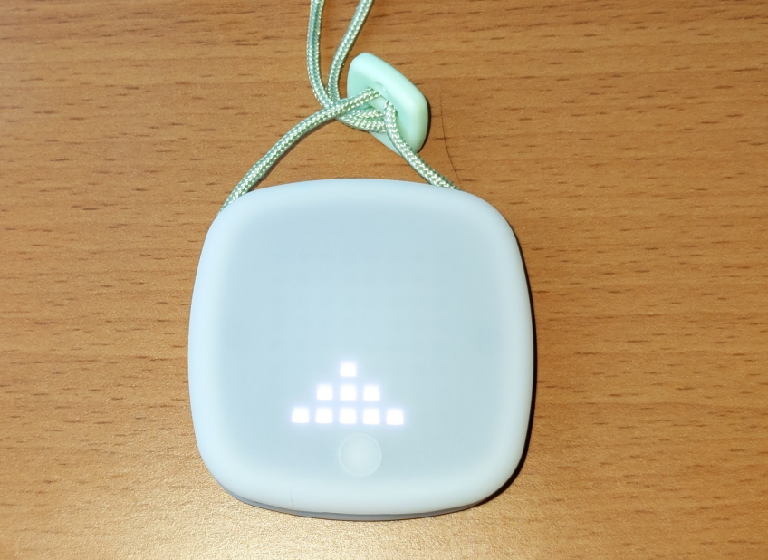

# ImagiCharm

## Vorbereitung

Zur Durchführung dieser Aufgabe benötigen Sie die ImagiCharm App und den ImagiCharm-Schlüsselanhänger.

## Specs

Der ImagiCharm ist ein kleiner Schlüsselanhänger mit einem 8x8-Pixel-Display, welches Sie mit Python über eine App programmieren können. Das grundlegende Element dabei ist eine 2-dimensionale Liste namens `m`. Beachten Sie, dass Listen-Indexe in Python immer bei 0 beginnen, die Nummerierung geht also von 0 bis 7.

~~~python
m[Zeilennummer][Spaltennummer] = FARBE
~~~

Beispiele:

~~~python
m[3][4] = ON    # weiß
m[3][4] = RED   # rot
m[3][4] = R     # auch rot
~~~

Am besten machen Sie sich zunächst vertraut mit dem ImagiCharm und der App und spielen das Tutorial durch. In diesem setzen Sie hauptsächlich manuell die Werte des Arrays auf die Farben, in denen die Pixel aufleuchten sollen, damit lustige Figuren angezeigt werden. Sie werden dazu einen ImagiLabs-Account benötigen. Während des Tutorials werden Sie dazu aufgefordert, einen solchen anzulegen.

In dieser Lab-Aufgabe geht es nun aber darum, eine Mario-Pyramide in Python zu programmieren, die auf dem ImagiCharm dargestellt werden soll. In der Imagi-App unter dem Punkt "Create" können Sie direkt mit der Programmierung loslegen. Achtung: Nicht einfach jeden Pixel einzeln auf ON setzen! Verwenden Sie Schleifen, Variablen und Co.

Zusatzaufgabe: Schau dir in der [Online-Dokumentation](https://www.notion.so/6abe65e2127c455d942eea5820d19587) von ImagiCharm an, wie [Animationen](https://www.notion.so/f4e1603d065242e4a4720f76fc88b791) funktionieren. Nutze dieses Wissen, um einen roten Punkt (Mario) die Pyramide auf- und absteigen zu lassen.

## Testen

Sie können Ihr Programm in der App testen und im Erfolgsfall per Bluetooth auf den Imagicharm übertragen.

## Abgabe

Dies ist eine optionale Übungsaufgabe, welche nicht abgegeben werden muss.