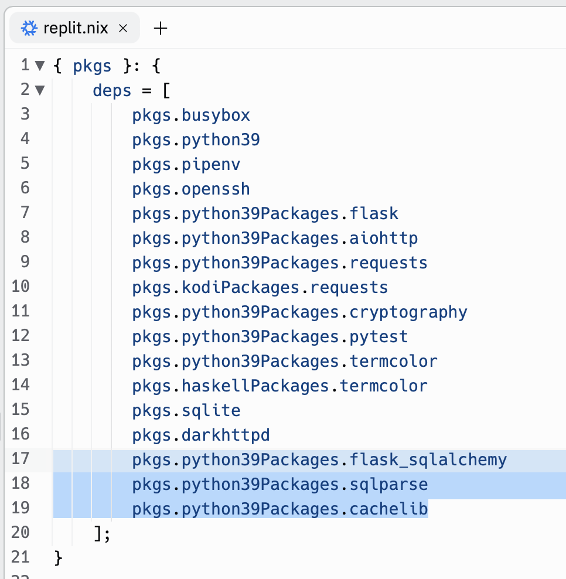
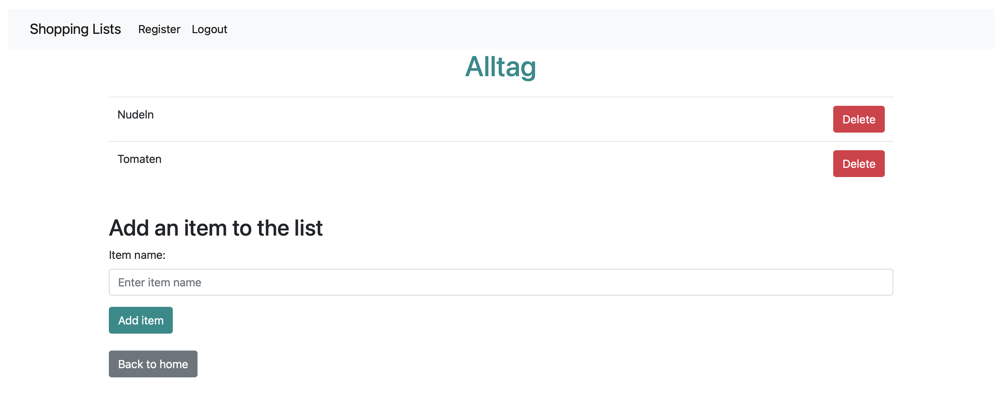

# Shoppinglists

Diese Aufgabe ist optional und bietet Ihnen noch mehr Übungsmöglichkeiten.

*Beachten Sie vor der Implementierung der eigentlichen Lab-Aufgabe auch die Tipps, die weiter unten angegeben sind.*

## Vorbereitung

In ELO finden Sie bei der dazugehörigen Aufgabe einen Link. Klicken Sie auf diesen, um mit der Bearbeitung der Aufgabe zu beginnen. Kehren Sie nach dem Öffnen der Seite zu dieser Anleitung zurück.

Link zu ELO/Moodle: [https://elearning.oth-regensburg.de](https://elearning.oth-regensburg.de)

Laden Sie sich den Startercode für die Aufgabe mit dem `get EXERCISE_NAME` Befehl in replit (OTH-Console) herunter. 

Bereiten Sie Replit für die Entwicklung vor: Ergänzen sie - wie in Lab 08 - folgende drei Zeilen in `replit.nix`:
- pkgs.python39Packages.flask_sqlalchemy
- pkgs.python39Packages.sqlparse
- pkgs.python39Packages.cachelib

Falls Ihre OTH-Console aktuell läuft, sollten Sie sie mit einem Klick auf "Stopp" und "Run" an dieser Stelle neu starten, um die Änderungen des .nix-Files wirksam zu machen.

Wechseln Sie in die Shell. Dort wechseln Sie mit `cd` in den Ordner der Lab-Aufgabe. Geben Sie nun folgenden Befehl ein, um die Datenbank vorzubereiten:

~~~shell
~/replitproject/lab-09-shoppinglists-xYoshioka$ sqlite3 shopping.db < create_db.sql
~~~

## Specs

In dieser Lab-Aufgabe haben Sie den unvollständigen Code für eine Flask-Anwendung erhalten. Die Anwendung soll das Managen von Shoppinglisten ermöglichen. Dem User wird ein Überblick über seine verschiedenen Shoppinglisten, z.B. Alltag, Weihnachten oder Drogerie, gegeben. Zusätzlich kann man seine Shoppinglisten ansehen und Items hinzufügen oder löschen. Ein User kann sich einloggen, registrieren oder ausloggen.

Ihre Aufgabe ist es, den Code zu analysieren und zu vervollständigen.

### Filestruktur

Wichtig sind für Sie folgende Ordner und Files:

- `static`-Ordner: Hier finden Sie das `.css`-File
- `templates`-Ordner: Hier finden sie alle `.html`-Files (HTML- oder Jinja-Templates), die die Website benötigt
- `app.py`: Hier finden Sie den gesamten Python-Code ihrer Flask-Anwendung
- `create_db.sql`: Hier können Sie nachsehen, wie die vorhandenen Tabellen aufgebaut sind und welche Spalten sie besitzen

Alternativ können Sie sich in der Shell nach Eingabe von `sqlite3 shopping.db` mit `.tables` oder `.schema tablename` (ersetzen Sie tablename duch einen beliebigen, vorhandenen Tabellennamen) auch die Informationen zu den Tabellen anzeigen lassen. Sie können sich hier beispielsweise mit einem SELECT-Befehl auch alle bereits vorhandenen User ausgeben lassen.

Machen Sie sich mit den vorhandenen Tabellen und Daten in der Datenbank vertraut.

### Codeanalyse - Einarbeitung in vorhandenen Code

Nachdem Sie sich oberflächlich mit den vorhandenen Files vertraut gemacht haben, sollen Sie sich nun intensiver mit dem Code beschäftigen.

Starten Sie die Flask-Anwendung in der Shell. Sie müssen sich hierfür im Ordner der Lab-Aufgabe befinden. 
~~~shell
~/replitproject/lab-09-shoppinglists-xYoshioka$ flask run --host=0.0.0.0
~~~

Es öffnet sich eine leere Webview. Sehen Sie sich die Website mit "Open in a new tab" genauer an. Testen Sie, welche Funktionalitäten schon vorhanden sind und was evtl. noch fehlt. Zum Login können Sie einen, der bereits in der Datenbank vorhandenen, User nehmen.

Tipp: Beenden Sie den Server mit "Strg" + "c" (Mac: "Control" + "c")

Nachdem Sie sich genauer mit der Website auseinandergesetzt haben und evtl. auch schon eine neue Shopping Liste erstellt haben, sollen Sie sich nun den Code genauer ansehen.

Fangen Sie in `app.py` an. Gehen Sie den Code Route für Route durch.

*Routen beziehen sich auf die URL-Muster der Flask-Anwendung. Bei Aufruf einer URL wird eine bestimmte Funktion aufgerufen. Wenn z.B. die URL `https://replitproject.xyoshioka.repl.co/new_list` aufgerufen wird, wird im Code die `@app.route('/new_list')` folgende Funktion `def new_list()` ausgeführt.*

Beachten Sie hierbei folgende Fragen:
- Was macht der Code? (Die Kommentare im Code helfen!)
- Wie wirkt sich der Code auf die Website aus?
- Welche `.html`-Files benötigt der Code?
- Wie sehen diese aus? Was wird hier dargestellt? (Sehen Sie sich im Ordner `templates` die entsprechenden HTML-Files [HTML- oder Jinja-Templates] an.)
- Wie sieht die dazugehörige Website im Browser aus? (Sehen Sie sich die entsprechende Unterseite über den Server im neuen Tab an.)

### Codeanalyse - Aufgabe

Im Ordner des Labs finden Sie die Datei `explain_register.txt`. Erklären Sie hier kurz aus technischer Sicht, was passiert, wenn ein User den Register-Button drückt. Welcher Code wird ausgeführt und was hat dies für Auswirkungen? Verwenden Sie Dateinamen und Zeilenummern, um klar zu machen, auf welchen Teil des Codes Sie sich beziehen.

### Fehlender Code

*Sehen Sie sich vor der tatsächlichen Bearbeitung der folgenden Aufgaben auch die weiter unten stehenden Tipps an. Diese erleichtern Ihnen die Arbeit!*

Wie Sie bestimmt schon bemerkt haben, fehlt an einigen Stellen essentieller Code für die Anwendung. Haben Sie alle Stellen entdeckt? 

Im Code sind die entsprechenden Stellen mit "ToDo:" und einer Beschreibung des erwarteten Verhaltens markiert. Sie sollen diese Stellen ergänzen, so dass die Anwendung korrekt funktioniert und die Darstellung auf der Website passend ist. Es handelt sich um folgende Punkte:

1. `app.py` - `def view_list(list_id)`

    Die Implementation der Ansicht der Items einer Shopping Liste fehlt. Befüllen Sie hier die Variable `items` mit den passenden Daten (siehe Kommentar im Code).
2. `list.html`

    Um die abgefragten Items nun auch anzeigen zu können, fehlt noch die Implementation des User Interfaces. Fügen Sie hier den Code zur Darstellung der Items einer Shopping Liste ein. Jedes Item benötigt zusätzlich einen Delete-Button. Diesen können Sie jedoch auch später während der Implementation von `def delete_item(list_id, item_id)` ergänzen. Der Screenshot weiter unten zeigt eine mögliche Version der "List" Seite.
3. `app.py` - `def add_item(list_id)`

    Items können nun zwar angezeigt werden, jedoch können Sie noch keine neuen Items hinzufügen, wenn sie auf den Button "Add item" klicken. Implementieren Sie hierfür den passenden Code. Speichern Sie das vom User eingegebene Item in der Datenbank. Fügen Sie das Item nur der Liste hinzu, wenn `list_id` und `item_name` gefunden/angegeben wurden.
4. `app.py` - `def delete_item(list_id, item_id)`

    Der Button "Delete" hat aktuell noch keine Funktionalität. Implementieren Sie das Löschen eines Items. Verwenden Sie hierfür die `list_id` und `item_id`, um sicherzugehen, dass Sie das richtige Item löschen.

Achten Sie auch auf den korrekten Return Value der Funktionen! Soll eine Weiterleitung zu einer anderen Seite stattfinden? Oder soll ein HTML-File angezeigt werden?

Folgender Screenshot zeigt, wie die "List" Seite aussehen könnte:

### Tipps

Verwenden Sie `url_for()`, um eine URL zu generieren - wie dies auch im vorhandenen Code der Fall ist (z.B. in app.py - def home() oder in home.html). Diese Funktion generiert aus dem gegebenen Namen [, der auch bei @app.route() angegeben ist] die entsprechende URL, z.B. `redirect(url_for('login'))`. Zusätzlich können noch Werte angegeben werden, die für den variablen Teil der URL verwendet werden sollen:
~~~html
<a href="{{ url_for('delete_list', list_id=shopping_list['id']) }}" class="btn btn-danger" role="button">Delete</a>
~~~
Hier wird beispielsweise der Parameter list_name gefüllt und die variable, nachfolgende URL für jede Shopping-Liste erzeugt:
~~~python
@app.route('/delete_list/<list_id>', methods=["GET"])
def delete_list(list_id):
~~~
Dieser Parameter kann hier dann zudem in der Funktion `def delete_list` verwendet werden.

#### Aufgabenspezifische Tipps:

1. `app.py`: `def view_list(list_id)`

    Die Implementation ist mit einer Zeile Code möglich. 
    Manuelles Testen Ihres Codes: Loggen Sie sich nachfolgend mit dem bereits vorhandenen User "Anna" ein, welcher schon eine mit Items gefüllte Shopping-Liste besitzt, um die Korrektheit ihres Codes besser erkennen zu können. 
2. `list.html`

    Sehen Sie sich die Auflistung der einzelen Shoppinglists in `home.html` an. Der Aufbau ist sehr ähnlich.
    Integrieren Sie folgenden Code für den Delete-Button in das HTML-File:
    ~~~html
    <a href="{{ url_for('delete_item', list_id=list_id, item_id=item.id) }}" class="btn btn-danger" role="button">Delete</a>
    ~~~
3. `app.py`: `def add_item(list_id)`

    Sehen Sie sich `def add_list()` an. Der Aufbau ist sehr ähnlich.
4. `app.py`: `def delete_item(list_id, item_id)`

    Sehen Sie sich `def delete_list()` an. Der Aufbau ist sehr ähnlich. 

## Testen

Rufen Sie ihre Website während der Implementierung immer wieder auf und testen Sie die Funktionalität und Darstellung, um sofort zu sehen, ob ihr Code zur gewünschten Änderung geführt hat. Um Änderungen auf der Website sichtbar zu machen, ist es notwendig, den Server gegebenenfalls zu beenden und mit `flask run --host=0.0.0.0` neu zu starten.

Wenn alle manuellen Tests erfolgreich waren, können Sie Ihr Programm auch wie folgt automatisch auf der OTH-Console testen:

    check EXERCISE_NAME

Tipp: Der `EXERCISE_NAME` beginnt mit `lab-09-shoppinglists-` und endet mit Ihrem GitHub Usernamen.

## Abgabe

Dies ist eine optionale Übungsaufgabe, welche nicht abgegeben werden muss.
