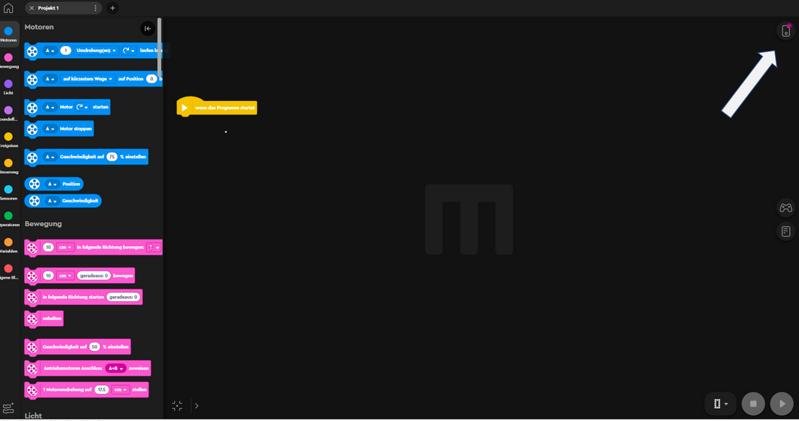
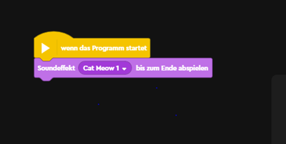

Note Challenge

Scratch und Robotik

[[toc]]

# Aufbau einer Verbindung zum Hub

Jetzt wollen wir unseren Lego® Roboter mit Scratch steuern. Dazu benötigen wir die Lego® Mindstorms App. Wir öffnen diese und klicken untern rechts auf “Programmieren”. 

Anschließend öffnet sich eine Ansicht, welche Scratch sehr ähnlich ist. Wir sehen das im Programmierbereich der Lego® App bereits standardmäßig der Startbefehl (Randstein) vorhanden ist. Diesen kennen wir bereits von Scratch. 

Zuerst müssen wir eine Bluetooth Verbindung mit unserem Hub (d.h. Lego® Roboter) herstellen. Wir klicken auf das Symbol oben rechts. 

Wir folgen den Anweisungen der Lego® App und verbinden den Hub. 

Wir sehen an welchen Ports die Motoren bzw. der Sensor angeschlossen ist. In unserem Fall sind die Antriebsmotoren auf A und B angeschlossen. Diese Information ist wichtig für die spätere Programmierung. 

In der Menüleiste links sind nun Abschnitte mit den Befehlen für den Lego® Roboter  hinzugekommen z. B. “Motoren” und “Bewegung” gegenüber dem reinem Scratch. Wir wollen aber zuerst wieder einen Ton ausgeben. Dazu gehen wir in Soundeffekte und holen den Befehl “Soundeffekt Cat Meow 1 bis zum Ende abspielen”. 

# Erste Befehle (Effekte)

Wir fügen den Klangbefehl an “Wenn das Programm startet” an. Wir starten das Programm über einen Klick auf den Play Button unten rechts und hören einen Ton.

In der Gruppe “Licht” gibt es weitere tolle Effekte welche wir ausprobieren wollen. Wir fügen die dargestellten Befehle an dem Klangbefehl an und starten wieder das Programm. Nun erscheinen diverse Anzeigen auf dem Roboter. 

# Den Roboter fahren lassen

Zuerst wollen wir ein Programm erstellen, welches den Lego® Roboter für 3 Sekunden vorwärts fahren lässt. Dazu gehen wir wie folgt vor. Wir lassen das Programm wissen, dass die Antriebsmotoren an den Ports A und B angeschlossen sind. Diesen Befehl finden wir in der Gruppe “Bewegung”. Wir holen einen weiteren Befehl durch den sich die Motoren für 3 Sekunden nach vorne bewegen. Wir drücken den Play Button und testen unser Programm. 

Wir wollen nun den Roboter auch wieder zurück fahren lassen. Dazu brauchen wir einen Befehl, der die Motoren für 3 Sekunden in die andere Richtung dreht. Wieder testen wir das Programm. 

Wir wollen nun, dass der Roboter bevor er zurück fährt eine Sekunde stehen bleibt. Einen entsprechenden Befehl finden wir in der Gruppierung unter “Motoren” bzw. “Bewegung” nicht. Deshalb blicken wir in die Gruppe “Steuerung” dort gibt es den Befehl “Warte 1 Sekunde”. Diesen Befehl fügen wir jetzt zwischen den Bewegen-Befehlen ein.

Wir lassen unser Programm wieder laufen und schauen was passiert.

Dieses Programm wollen wir jetzt speichern. Dazu klicken wir oben rechts und bekommen dann die Möglichkeit das Projekt entsprechend zu benennen. 

Bevor wir gleich damit beginnen, dass der Roboter einen Stern fährt, wollen wir noch einen weiteren Befehl kennen lernen und zwar die Geschwindigkeit auf 50% einzustellen. Wir ziehen den Befehl, welchen wir in der Gruppe “Bewegung” finden,  nach “Antriebsmoteren Anschluss zuweisen“ ein.  Wir probieren  verschiedene Geschwindigkeiten aus. 

# Fahren einer Sternformation

Ziel ist es nun, dass der Roboter diese Sternformation abfährt. 

Wir erweitern unser bestehendes Programm. Zuerst müssen wir die Drehung implementieren. Dazu holen wir den Bewegen-Befehl, welchen wir bereits kennen, und fügen ihn an unser Programm an. Für 180 Grad lassen wir die Antriebsmotoren nach rechts drehen. Dies entspricht dann ca. einer Drehung des Lego® Roboters um 90 Grad nach rechts.

Anmerkung: Abhängig z. B. von Beschaffenheit des Bodens sind mehr Grad einzustellen.

Nun erweitern wir das Programm  um das Vorwärtsfahren, Warten, Zurückfahren und wieder Drehen. Dazu nutzen wir die rechte Maustaste und duplizieren die entsprechenden Befehle. Wir klicken in den Baustein 3 Sekunden nach vorne bewegen. Und schon haben wir den halben Stern programmiert. Wir testen wieder unser Programm. 

So sieht das vollständige Programm aus. Wir haben sehr viel doppelt programmiert. Das wollen wir jetzt verbessern. 

# Fahren einer Sternformation (mit einer Schleife)

Wir wollen nun eine Schleife verwenden, welche wir bereits im Teil Scratch kennen gelernt haben. Wir schieben den Code nach unten weg, da wir den nicht mehr brauchen. 

Wir benötigen eine Zählerschleife, welche genau 4 mal durchlaufen werden soll. Wir benötigen jetzt Vorfahren, Warten, Rückwärtsfahren und die Drehung je nur 1 mal.

Wollen wir, dass der Roboter fortlaufend- also so lange bis die Batterien leer sind - den Stern abfährt, dann wechseln wir zur Schleife “wiederhole fortlaufend”. Diese Schleife bezeichnet man auch als Endlosschleife. 

Anmerkung: Zum Beenden des Programms auf den roten Stoppbutton (neben dem Playbutton) drücken. Es ist auch möglich die Geschwindigkeit außerhalb der Schleife auf 50% zu setzen so, dass diese Anweisung nur einmal ausgeführt wird.

# Abstandssensor

 In unserem Roboter ist ein Abstandssensor verbaut, welcher den Abstand zu einem Gegenstand misst. Wir möchten nun mit den vorhandenen Befehlen zum Abstandssensor experimentieren. (Der Abstandssensor ist an Port D angeschlossen).

 Wir holen den Befehl “Den gemessenen Abstand zu einem Objekt in einer Variablen speichern” und wollen diesen Abstand im Display ausgeben. Dazu programmieren wir untenstehendes Programm. 

Nun stellen wir z. B. ein Buch vor den Lego® Roboter und wir bekommen eine Zahl auf dem Roboter angezeigt. Diese sollte dem Abstand entsprechen.

Wir wollen nun das Programm so erweitern, das der Roboter einen Signalton ausgibt, wenn das Objekt, d.h. das Buch, näher als 10 Zentimeter an unserem Roboter dran ist.

Dazu benötigen wir wieder eine Abfrage. Falls der Abstand näher als 10 cm ist, dann wird der Piepton ausgegeben, Den Befehl für den Piepton findest wir in der Gruppe “Soundeffekte”. Wir testen unser Programm, wobei der Abstand einmal sehr klein und einmal sehr groß ist. 

