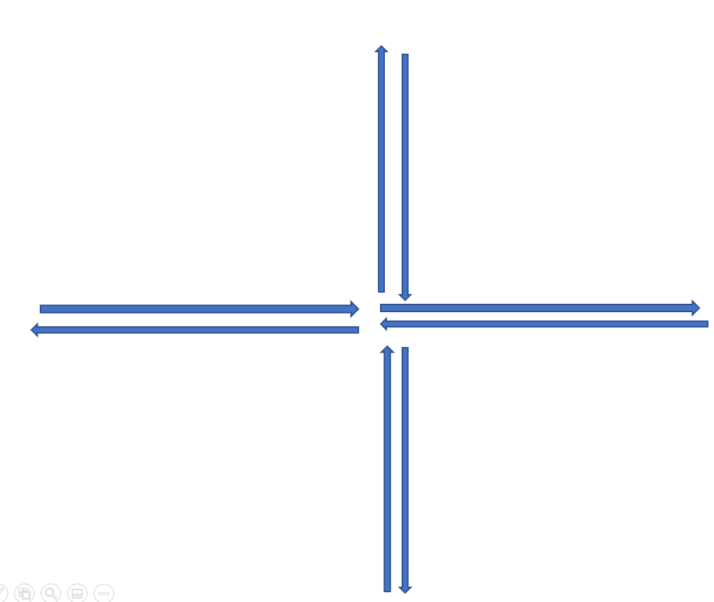

# Sternformation

## Vorbereitung

Zur Durchführung dieser Aufgabe benötigen Sie den Lego® Roboter (diesen bitte im Vorhinein aufladen) und die Lego® App (siehe Slides).

## Specs

Der Roboter soll nachstehende Sternformation abfahren. Die Länge des Sterns können Sie beliebig wählen. Bei der Erstellung des Programms ist eine Schleife zu verwenden.

## Testen

Laden Sie Ihr Programm auf den Roboter und testen Sie, ob das Programm einwandfrei funktioniert.

## Abgabe

Dies ist eine optionale Übungsaufgabe, welche nicht abgegeben werden muss.

