Note Challenge

Python mit Lego® Roboter

[[toc]]


In der letzten Challenge haben Sie Python kennen gelernt. Auch der Lego® Roboter kann mit Python programmiert werden. Dies wollen wir uns in dieser Challenge ansehen. 

# Anlegen eines Python Programms

Öffnen Sie die Lego-Mindstorms App und klicken Sie auf das +. 

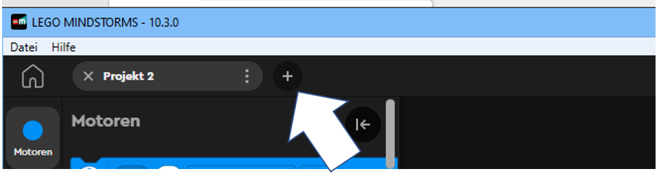

Anschließend können Sie auswählen, ob Sie mit Scratch (Textblöcken) oder mit Python programmieren wollen. Wählen Sie Python.

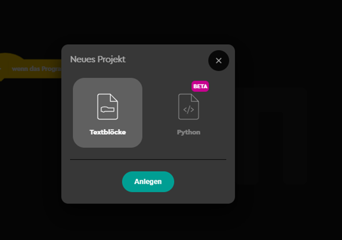

Es öffnet sich folgende Maske. Es werden bereits einige Bibliotheken importiert.

Der Hub ist bereits als Objekt angelegt worden. 

In lila dargestellt sind Kommentare, welche zu Ihrer Information dienen.

Ein erster Befehl und zwar das Ausgeben eines Tons ist bereits programmiert worden. Starten sie das Programm und prüfen Sie, ob Ihr Roboter den Ton ausgibt. Das Starten des Programms erfolgt wieder über den Play Button unten rechts.

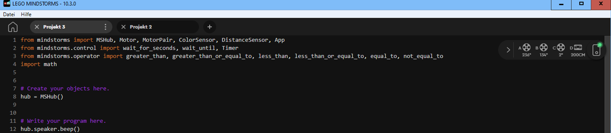


# Hello World

Zuerst wollen wir wieder Hello World ausgeben. Dazu geben wir den Befehl print (”Hello World;”) ein. Wir drücken den Play Button, öffnen die in der App integrierte Console und sehen, dass “Hello World” ausgegeben wird.

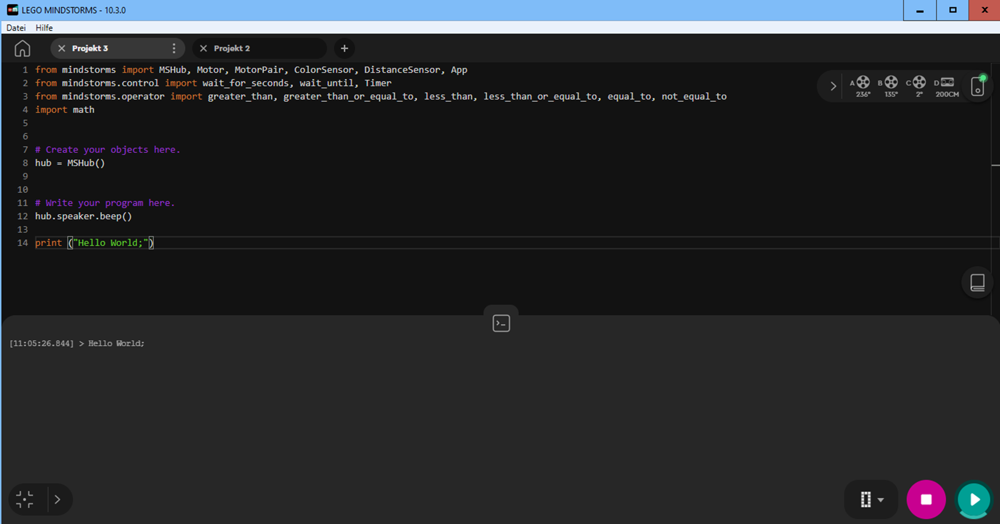


# For-Schleife

Wir können in der Lego® App die bereits bekannte For-Schleife verwenden um z. B. dreimal das Wort “Miau” auszugeben.

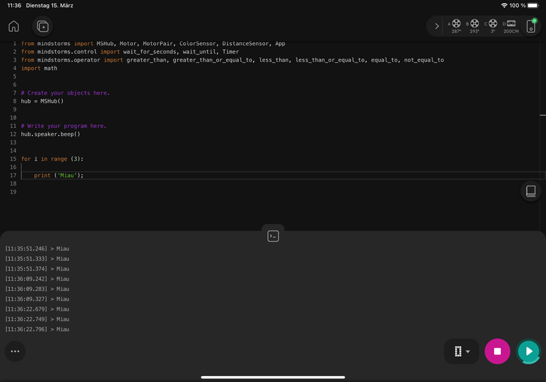


# Python Befehle für den Lego® Roboter 

Nun möchten wir den Lego® Roboter mit Python programmieren. Dazu benötigen wir eine Liste der Befehle. Diese können wir uns über die Hilfe herholen. Wir klicken auf das Fragezeichen auf der Startseite. 

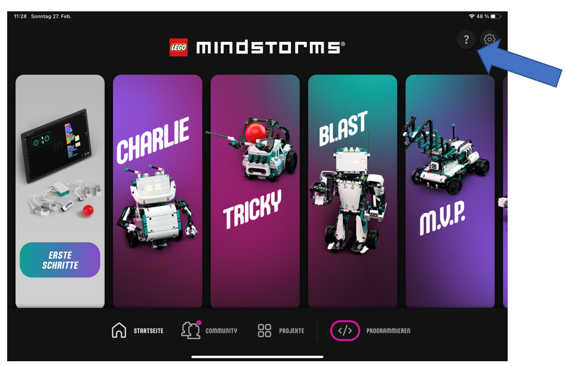

Anschließend wählen wir Python.

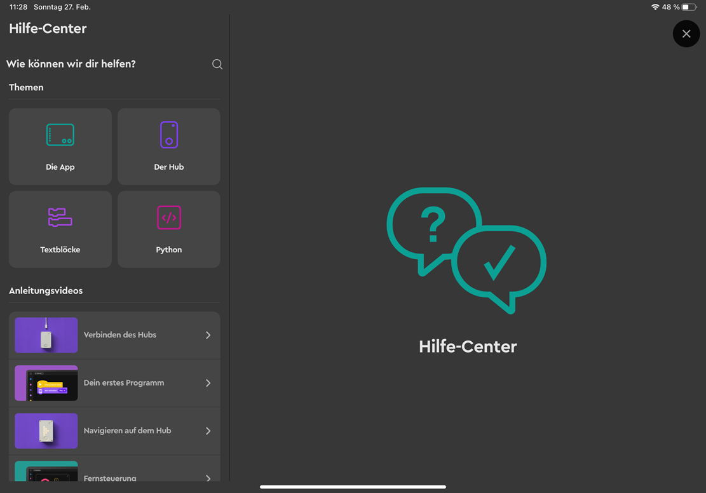

Wir können uns hier verschiedene Grundlagen und Bibliotheken detailliert ansehen. 

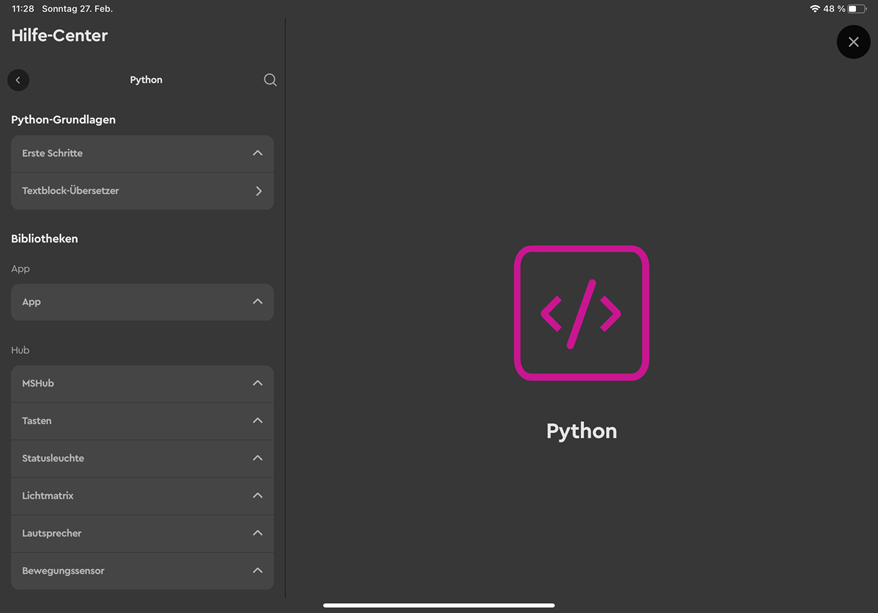

# Erste Befehle (Effekte) 

Wir sehen uns nun einige Befehle basierend auf der Hilfe der Lego Mindstorms App an. Zuerst möchten wir auf den Hub einen Smiley ausgegeben. Der zugehörige Befehl lautet wie folgt. 

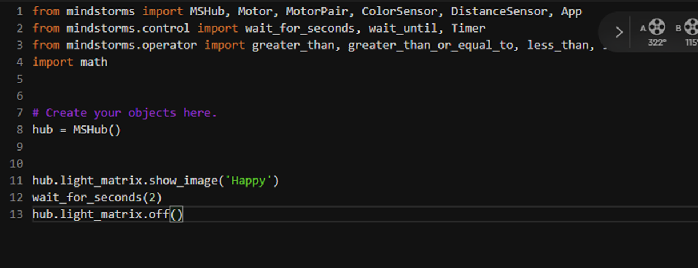

# Motorenbewegung 

Nun wollen wir einen Motor für eine Sekunde bei einer Geschwindigkeit von 75% laufen lassen. 

Der dazugehörige Befehl lautet wie folgt, wobei zuerst die Sekunden und dann die Geschwindigkeit eingegeben wird. Mit Hilfe dieses Befehls kann somit eine Drehung umgesetzt werden.

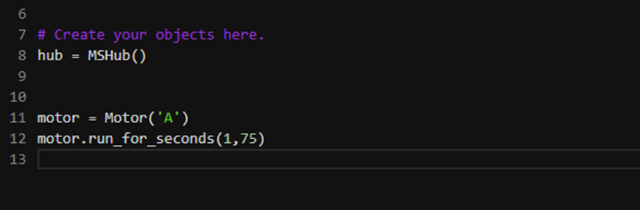

Eine Drehung kann auch mit untenstehendem Befehl umgesetzt werden. Abhängig u.a. von der Bodenbeschaffeneheit ist wieder die Gradzahl einzustellen. In diesem Beispiel entspricht der untenstehende Befehl ca. einer Drehung des Roboters um 90 Grad. 

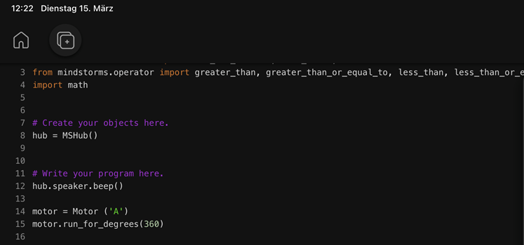

Möchten wir eine gerade Strecke vorwärts fahren dann lautet der zugehörige Befehl wie folgt. Möchten wir rückwärts fahren dann fügen wir ein Minuszeichen vor den 10 cm ein. 

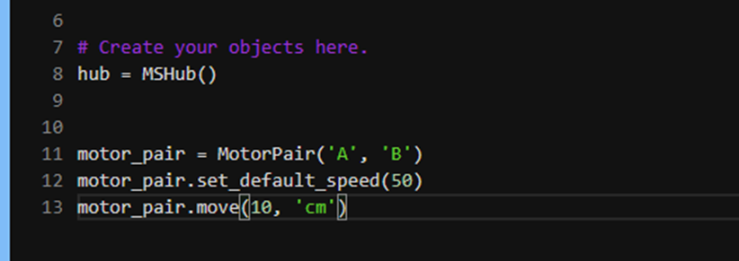

Soll der Roboter nach dem Drücken des Startkopfs erst 2 Sekunden warten bevor er 10 cm  vorwärts fährt so lautet das zugehörige Programm wir folgt. 

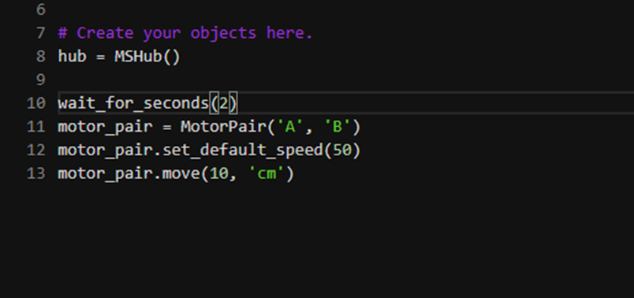

# Ein Quadrat abfahren

Wir wollen nun die Übungsaufgabe vom Teil “Scratch und Robotik” nachprogrammieren und ein Quadrat abfahren. Dazu benötigen wir eine Schleife und die bereits bekannten Befehle zum gerade aus fahren und für die Drehung. Wir testen wieder unser Programmm. 

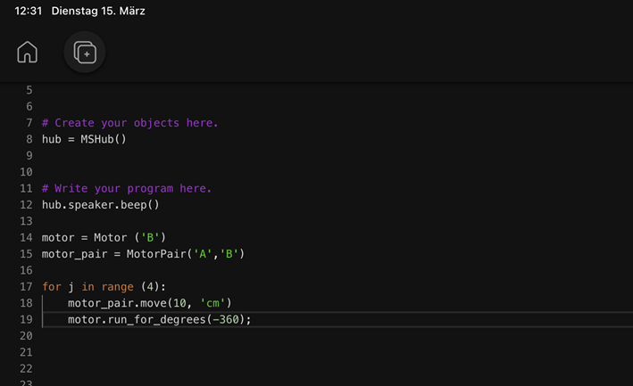

# Abstandssensor

In der Übungsaufgabe haben Sie ein Programm mit Hilfe des Abstandssensors programmiert. Wir möchten dieses Programm nun auf Python umschreiben. Zu Nutze machen können wir uns, dass es hier den “```wait_for_distance_closer_than```” Befehl gibt. Dieser Befehl wartet so lange bis die Bedingung erfüllt ist und führt anschließend den nächsten Befehl aus. 

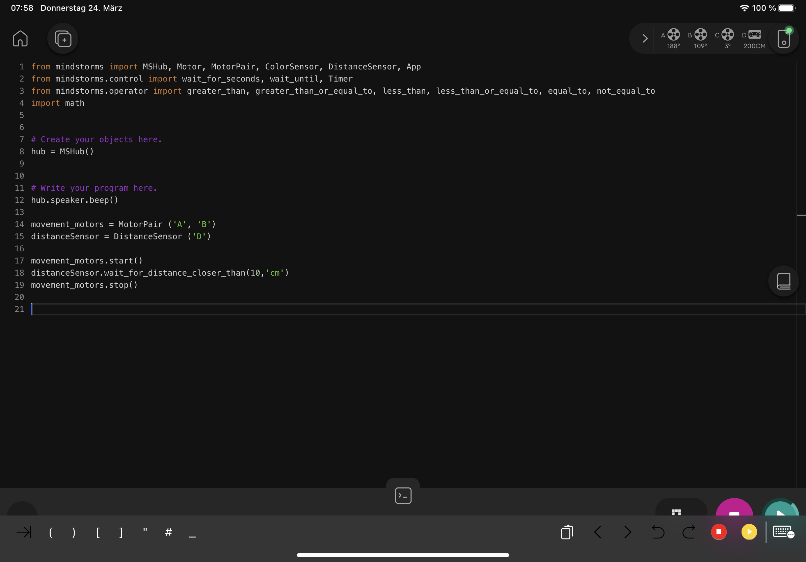