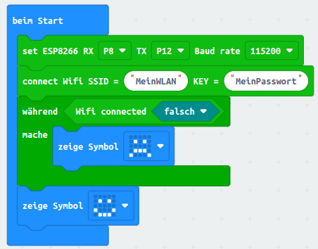
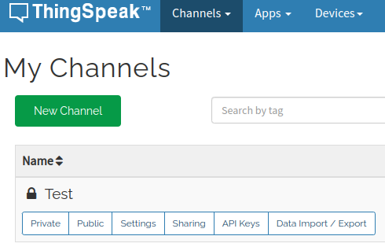
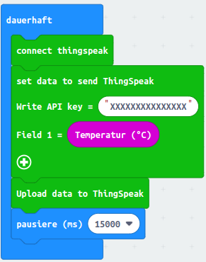
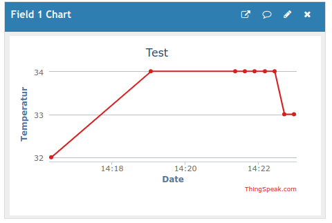
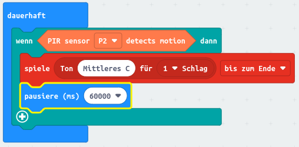

Note Challenge

IoT

[[toc]]

# Internet of Things

Der Begriff Internet, also das internationale Netz - ist in aller Munde. Internet bedeutet, dass Rechner auf der ganzen Welt miteinander verbunden sind, damit man Dienste nutzen kann, wie zum Beispiel dem Besuch von Internetseiten im Webbrowser, dem Versenden und Empfangen von E-Mails oder dem Streamen von Videoinhalten. 

Unter dem Internet of Things (IoT), also dem Internet der Dinge, wird dieser Begriff nun erweitert und beschränkt sich nicht mehr nur auf Computer, Laptops, Server und Smartphones. Im IoT ist ALLES vernetzt! Armbanduhren, Waschmaschinen, Thermometer, Lichtschalter und vieles mehr. Diese Geräte besitzen in der Regel Sensoren und/oder Aktoren. Ein Sensor liefert einen Wert, zum Beispiel der Themometer hat einen Temperatursensor, den er in die Cloud, also ins Internet senden kann. Und ein Aktor kann etwas tut, zum Beispiel die Waschmaschine, der man übers Internet sagen kann, dass der Waschvorgang nun starten soll, oder der Lichtschalter, dem man übers Handy aktivieren kann. 

Auch wenn das noch nach Zukunftsmusik klingt, ist das Internet der Dinge schon voll im Gange. Smarte Wetterstationen, Waschmaschinen und Lichtschalter kosten nur wenig mehr als klassische Geräte. Der Grund dafür ist, dass gar nicht viel benötigt wird, um ein Gerät “smart” zu machen: Man braucht einen kleinen Minicomputer, der sich über WLAN mit dem Internet verbinden kann. sowie die entsprechenden Sensoren und Aktoren. Eine Stromversorgung haben die Geräte ja ohnehin meistens schon.

# Micro:bit

Der micro:bit ist ein kleines Gerät, was man fast schon in die Kategorie Internet of Things einordnen kann. Er hat Knöpfe, ein Display, Sensoren für Temperatur, Licht, Bewegung, usw. Aber ich sage “fast”, weil der micro:bit ja gar keine Verbindung zum Internet besitzt. Zwar kann er über Funk Nachrichten an andere micro:bits senden und empfangen, aber er kann sich zum Beispiel nicht mit einem WLAN-Netzwerk verbinden.

Aber genau dafür gibt es die iot:bit-Platine. Auf diesem kleinen Board befindet sich ein WLAN-Modul, ganz viele Anschlüsse, um Erweiterungen anzuschließen, und sogar ein Uhrzeit-Modul, damit der micro:bit weiß, wie spät es ist. Damit die Uhrzeit nicht verloren geht, wenn der micro:bit vom Strom getrennt wird, braucht es aber eine kleine Knopfbatterie.

Wenn wir den micro:bit in die Platine einsetzen, ist es wichtig, dass wir den linken Micro-USB-Anschluss verwenden, um sowohl die Platine als auch den micro:bit mit Strom zu versorgen. Die Batterie-Erweiterung funktioniert zusammen mit dem iot:bit leider nicht. Auch ist es nicht möglich, den iot:bit über den USB-Anschluss, der sich direkt am micro:bit befindet mit Strom zu versorgen. Wichtig für die Stromversorgung ist also der Micro-USB-Anschluss an der Erweiterungsplatine. Der andere Anschluss wird nur zum Übertragen der Programme verwendet. Wenn man auf Nummer sicher gehen will, schließt man also am besten das Gerät mit 2 USB-Kabeln an den Computer an. Eins für den Strom, eins für die Daten. Später, wenn wir mit dem Programmieren fertig sind, kann man das Datenkabel dann trennen und für die Stromversorgung auch gerne auf ein USB-Steckernetzteil oder eine Powerbank wechseln.

In der Makecode-Programmierumgebung auf [makecode.microbit.org](http://makecode.microbit.org) können wir, nachdem wir ein neues Projekt angelegt haben, links auf Erweiterungen klicken und nach der iot-environment-kit-Erweiterung suchen.

Nachdem man die Erweiterung angeklickt hat, gibt es links im Menü ein Paar neue Bereiche:

- *Octopus*: Hier finden wir Zugriff auf alle Sensoren, die wir an die iot:bit-Platine per Kabel anschließen können: Bewegungsmelder, Lichtsensor, Bodenfeuchtesensor und mehr.
- *OLED*: An die mittleren Anschlüsse auf der iot:bit-Platine lässt sich ein kleines Display anschließen. Damit ist es dann zum Beispiel möglich, längere mehrzeilige Texte darzustellen.
- *RTC1307*: Das Modul für die Uhrzeit. Man kann die aktuelle Zeit einstellen und das aktuelle Datum und die Uhrzeit abrufen.
- *ESP8266_IoT*: Das WLAN-Modul. Mit ihm können wir uns mit einem WLAN-Netzwerk verbinden und Daten an einen Server schicken. Es stehen als Services ThingSpeak, Kidslot, MQTT und ITTT zur Verfügung. Wir werden ThinkSpeak verwenden.
- *Pins / Servo*: An die gelb-rot-schwarzen-Anschlüsse lassen sich neben Sensoren auch Servo-Motoren anschließen. Das ist ein Motor, der sich auf einen beliebigen Winkel zwischen 0 und 180 Grad drehen lässt.

Um ein Programm auf den micro:bit zu übertragen, gibt es zwei 
Möglichkeiten. Beim Klick auf "Herunterladen" kann sich der Browser 
entweder direkt mit dem per USB-Kabel verbundenen micro:bit koppeln, 
oder - falls dies nicht funktioniert - lässt sich eine .hex-Datei 
herunterladen. Der angeschlossene micro:bit erscheint wie ein USB-Stick 
als Laufwerk, auf das sich die .hex-Datei kopieren lässt.

# WLAN

Um uns mit einem WLAN zu verbinden, schieben wir die Bausteine “set ESP8266” sowie connect Wifi SSID in den “beim Start”-Bereich unseres Programms. Beim ersten Baustein kann man einfach alles so lassen wie es ist (RX P8 TX P12 Baud rate 115200) und beim Connect-Baustein muss der Name des WLAN-Netzes und das WLAN-Passwort eingetragen werden.

Um zu überprüfen, ob das ganze geklappt hat, können wir einfach mal in einer Schleife prüfen, ob Wifi immer noch nicht verbunden ist. So lange das der Fall ist, zeigen wir einen traurigen Smilie an. Wenn die Verbindung dann endlich herstellt ist, soll ein lachender Smilie erscheinen.

Als nächstes wird ein Account auf https://thingspeak.com benötigt. Das ist eine Webseite, zu der der micro:bit über das Internet Sensorwerte schicken kann. Diese lassen sich dann in Form von Diagrammen anzeigen. Der wichtigste Bereich bei Tingspeak ist der Bereich “My Channels”:

- Private: Hier kann man sich die aktuellen und historischen Werte, die der micro:bit gesendet hat, anschauen.
- Public: Man könnte die Daten auch für die Öffentlichkeit freigeben. Dann wäre das der Beich, den jeder einsehen kann.
- Settings: Hier lassen sich unter anderem Felder aktivieren und benennen. Für jede Art von Wert, die man übertragen will, braucht man ein Feld. Zum Beispiel ein Feld “Temperatur” und ein zweites Feld “Lichtstärke”. Für jedes Feld wird unter “Private” ein eigenes Diagramm über den Verlauf der Werte angezeigt.
- API Keys: Der dort zu findende “Write API Key” muss im micro:bit-Programm eingetragen werden.

Unter Private muss ein neuer Channel angelegt werden. Die dort stehenden 
Standard-Einstellungen können einfach übernommen werden. Lediglich 
sollten wir den zu übertragenen Daten-Feldern sollten wir 
aussagekräftige Namen geben, z. B. "Temperatur".

Wenn wir nur ein Feld “Temperatur” haben, können wir mit dem folgenden Programm kontinuierlich alle 15 Sekunden die aktuelle Raumtemperatur an den ThingSpeak-Server senden:

Der hier verwendete Temperatur-Baustein hat übrigens noch nichts mit den 
Sensoren aus dem IoT-Kit zu tun. Hier wird der auf dem micro:bit 
integrierte Temperatursensor ausgelesen, der jedoch sehr ungenaue 
Messwerte liefert.

Wichtig ist der Baustein “Upload data to ThingSpeak”. Ohne den werden die Daten nicht übermittelt.

In der “Private View” auf ThingSpeak lässt sich dann der Verlauf des übermittelten Wertes anschauen:

Beachte, dass der Temperatursensor, der sich direkt auf dem micro:bit befindet, sehr ungenau ist. Daher werden wir ab jetzt auf externe Sensoren ausweichen.

# Sensoren

An die gelb-rot-roten Anschlüsse auf der iot:bit-Platine können wir beliebige Sensoren anschließen und dann die Werte, die der entsprechende Sensor misst, in unserem micro:bit-Programm auslesen. Dazu schließen wir den Sensor über ein dreipoliges Kabel so an, dass der gelbe Draht auf der Platine auf gelb anliegt und am Sensor auf “S”. In der Makecode-Programmierumgebung können wir dann unter “Octopus” den entsprechenden Wert auswählen. Dabei dürfen wir nicht vergessen anzugeben, an welche Pins wir den Sensor angeschlossen haben.

Die meisten Sensoren funktionieren so: Wir fragen den Sensor nach einem aktuellen Messwert und zurück bekommen wir eine Zahl. Bei dem Lichtsensor ist das ein Helligkeitswert zwischen 0 (ganz dunkel) und 100 (ganz hell). Damit könnte man dann z. B. prüfen, ob gerade Tag oder Nacht ist oder ob die Tür vom Kleiderschrank geöffnet ist (sofern sich der Sensor im Kleiderschrank befindet).

Der PIR-Sensor funktioniert etwas anders. PIR steht für Passive InfraRed. Besser bekannt sind diese Teile aber als Bewegungsmelder. Der Sensor meldet einfach nur, ob aktuell Bewegung erkannt wurde oder nicht. Wir können in einem weiteren “dauerhaft”-Baustein kontinuierlich prüfen, ob Bewegung erkannt wurde oder nicht. Falls ja, soll der microbit einen Ton ausgeben:

Damit das Programm bei länger anhaltender Bewegung nicht dauerhaft piepst, wird nach dem Abspielen des Tons 15 Sekunden gewartet, bevor erneut auf Bewegung überprüft wird.